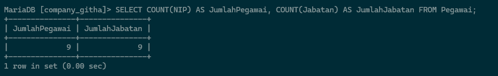
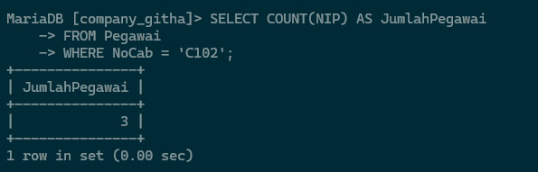

# Membuat Database
1. Pertama,  buatlah database pada cmd.
	 Code :
	 ```mysql
	 CREATE DATABASE company_githa;
	 ```

	![[asset/1.JPG]]

	Analisa :
	- `CREATE DATABASE company_githa;` : digunakan membuat database baru bernama "company_githa"

2. Kedua, gunakanlah database tersebut untuk membuat tabel didalam database tersebut.
	 Code :
	 ```mysql
	 USE company_githa;
	 ```

	![[asset/2.JPG]]

	Analisa :
	- `USE company_githa;` : digunakan untuk membuat kita berpindah ke dalam database "company_githa" untuk melakukan operasi-operasi selanjutnya.
# Membuat Table
 Code :
```mysql
	 CREATE TABLE pegawai ( 
	 NIP int (255) PRIMARY KEY, 
	 NDep varchar (255) NOT NULL, 
	 NBlk varchar (255), 
	 JK enum ('Laki-laki','Perempuan') NOT NULL, 
	 Alamat text (255) NOT NULL, 
	 Telp varchar (255) NOT NULL, 
	 Jabatan enum ('Manajer','Staf','Sales'), 
	 Gaji BIGINT (255) NOT NULL, 
	 NoCab varchar (255) NOT NULL 
	 );
```

![[asset/3.JPG]]

Analisa :
- `CREATE TABLE pegawai ( ` : digunakan untuk membuat sebuah tabel baru bernama "pegawai".
- `NIP int (255) PRIMARY KEY` : Ini adalah nomor unik yang digunakan untuk mengidentifikasi setiap pegawai. Setiap pegawai memiliki NIP yang berbeda. 
-  `NDep varchar (255) NOT NULL` : Kolom ini menyimpan nama depan pegawai. Nama-nama seperti 'Emya', 'Diah', 'Dian', dll.
-  `NBlk varchar (255)` :  Kolom ini menyimpan nama belakang pegawai. Nama-nama seperti 'Salsalina', 'Wahyuni', 'Anggraini', dll.
-  `JK enum ('Laki-laki','Perempuan') NOT NULL` : Kolom ini menyimpan jenis kelamin pegawai yaitu "Laki-laki" atau "Perempuan".
-  `Alamat text (255) NOT NULL` : Kolom ini menyimpan alamat lengkap pegawai. Data alamat seperti 'Jl.Suci 78 Bandung', dll., menunjukkan format teks yang panjang, sesuai dengan kebutuhan penyimpanan informasi alamat.
-  `Telp varchar (255) NOT NULL` : Kolom ini menyimpan nomor telepon pegawai. Data di sini adalah unik karena memiliki kunci unik (`UNI`), yang memastikan tidak ada dua pegawai dengan nomor telepon yang sama.
-  `Jabatan enum ('Manajer','Staf','Sales')` : Kolom ini menyimpan jabatan pegawai. Nilai yang ada seperti 'Manajer', 'Sales', dan 'Staf'. Adapun satu baris yang memiliki nilai kosong, yang menunjukkan bahwa jabatan untuk pegawai tersebut belum ditentukan.
-  `Gaji BIGINT (255) NOT NULL` : Kolom ini menyimpan gaji pegawai dengan kapasitas yang besar, sesuai dengan nilai-nilai yang ada misalnya, 5250000, 2500000, dll.
-  `NoCab varchar (255) NOT NULL` : Kolom ini menyimpan nomor cabang tempat para pegawai bekerja. Nilai seperti 'C101', 'C103', dan 'C104' menunjukkan bahwa pegawai tersebut dikelompokkan berdasarkan cabang, dan adapun beberapa pegawai yang memiliki cabang yang sama.

# Menampilkan Table
Code :
```mysql
	DESC pegawai;
```

![[asset/4.JPG]]

Analisa :
- `DESC pegawai;` : digunakan untuk menampilkan deskripsi atau informasi rinci tentang struktur tabel database yang berisi data pegawai.
# Memasukkan Data
Code :
```mysql
	DESC pegawai;
```

![[asset/4.JPG]]

Analisa :
- `DESC pegawai;` : digunakan untuk menampilkan deskripsi atau informasi rinci tentang struktur tabel database yang berisi data pegawai.
# Menampilkan Hasil Penginputan Data
Code :
```mysql
	SELECT * FROM Pegawai;
```

![[asset/6.JPG]]

Analisa :
- `SELECT * FROM Pegawai;` : digunakan untuk mengambil semua data dari tabel `pegawai`. Artinya, query ini akan menampilkan semua kolom dan baris yang ada di dalam tabel `pegawai`.


# Menampilkan Data
1. Menampilkan Jumlah Pegawai dan Jumlah Jabatan

	Analisis :
	1. `SELECT COUNT(NIP) AS JumlahPegawai`: Menghitung jumlah total pegawai berdasarkan kolom NIP.
	2. `COUNT(Jabatan) AS JumlahJabatan`: Menghitung jumlah total jabatan berdasarkan kolom Jabatan.
	3. `FROM Pegawai`: Data diambil dari tabel Pegawai

2. Menghitung jumlah baris data pada tabel NoCab 'C102'

	Analisis :
	1. `SELECT COUNT(NIP) AS JumlahPegawai`: Ini menghitung jumlah total pegawai berdasarkan kolom NIP (Nomor Induk Pegawai).
	2. `FROM Pegawai`: Data diambil dari tabel Pegawai.
	3. `WHERE NoCab = 'C102'`: Kondisi ini menambahkan filter, sehingga hanya menghitung jumlah pegawai yang memiliki nilai 'C102' pada kolom NoCab (Nomor Cabang).

3. Mengelompokkan data
	 ![[asset_1/3.png]]
	 Analisis :
	 1. `SELECT NoCab, COUNT(NIP) AS JumlahPegawai`: Ini menghitung jumlah pegawai berdasarkan kolom NoCab (Nomor Cabang) dan menampilkannya dengan nama kolom "JumlahPegawai".
	2. `FROM Pegawai`: Data diambil dari tabel Pegawai.
	3. `GROUP BY NoCab`: Hasil penghitungan akan dikelompokkan berdasarkan nilai pada kolom NoCab.

4. Menampilkan suatu kelompok data dengan menentukan kondisi yang terpenuhi
	 ![[asset_1/4.png]]
	Analisis :
	1. `SELECT NoCab, COUNT(NIP) AS JumlahPegawai`: Ini menghitung jumlah pegawai berdasarkan kolom NoCab (Nomor Cabang) dan menampilkannya dengan nama kolom "JumlahPegawai".
	2. `FROM Pegawai`: Data diambil dari tabel Pegawai.
	3. `GROUP BY NoCab`: Hasil penghitungan akan dikelompokkan berdasarkan nilai pada kolom NoCab.
	4. `HAVING COUNT(NIP) >= 3`: Kondisi ini menambahkan filter, sehingga hanya akan menampilkan cabang-cabang yang memiliki jumlah pegawai minimal 3.

5. Menampilkan suatu data yang telah dijumlahkan
	 ![[asset_1/5.png]]
	Analisis :
	1. `SELECT SUM(Gaji) AS Total_Gaji`: Ini menghitung total jumlah gaji dari semua pegawai dengan menjumlahkan nilai pada kolom Gaji, dan menampilkannya dengan nama kolom "Total_Gaji".
	2. `FROM Pegawai`: Data diambil dari tabel Pegawai.

6. Menampilkan data gaji yang telah dijumlahkan pada jabatan 'Manajer'
	![[asset_1/6.png]]
	Analisis :
	1. `SELECT SUM(Gaji) AS Gaji_Manajer`: Ini menghitung total jumlah gaji dari semua pegawai yang memiliki jabatan "Manajer", dan menampilkannya dengan nama kolom "Gaji_Manajer".
	2. `FROM Pegawai`: Data diambil dari tabel Pegawai.
	3. `WHERE Jabatan = 'Manajer'`: Kondisi ini menambahkan filter, sehingga hanya akan menghitung gaji untuk pegawai yang memiliki jabatan "Manajer".

7. Menampilkan data gaji yang sudah dikelompokkan berdasarkan 'NoCab'
	![[asset_1/7.png]]
	Analisis :
	1. `SELECT NoCab, SUM(Gaji) AS TotalGaji`: Ini menghitung total jumlah gaji dari semua pegawai berdasarkan kolom NoCab (Nomor Cabang), dan menampilkannya dengan nama kolom "TotalGaji".
	2. `FROM Pegawai`: Data diambil dari tabel Pegawai.
	3. `GROUP BY NoCab`: Hasil penghitungan akan dikelompokkan berdasarkan nilai pada kolom NoCab

8. Menampilkan data gaji yang telah dikelompokkan berdasarkan gaji '>=8000000'
	![[asset_1/8.png]]
	Analisis :
	1. `SELECT NoCab, SUM(Gaji) AS Total_Gaji`: Ini menghitung total jumlah gaji dari semua pegawai berdasarkan kolom NoCab (Nomor Cabang), dan menampilkannya dengan nama kolom "Total_Gaji".
	2. `FROM Pegawai`: Data diambil dari tabel Pegawai.
	3. `GROUP BY NoCab HAVING SUM(Gaji) >= 8000000`: Hasil penghitungan akan dikelompokkan berdasarkan nilai pada kolom NoCab, dan hanya akan menampilkan cabang-cabang yang memiliki total gaji lebih besar atau sama dengan 8.000.000.

9. Menampilkan rata-rata gaji pegawai
	![[asset_1/9.png]]
	Analisis :
	1. `SELECT AVG(Gaji) AS Rata_rata`: Ini menghitung rata-rata gaji dari semua pegawai, dan menampilkannya dengan nama kolom "Rata_rata".
	2. `FROM Pegawai`: Data diambil dari tabel Pegawai.

10. Menampilkan rata-rata gaji yang telah dijumlahkan pada jabatan 'Manajer'
	![[asset_1/10.png]]
	Analisis :
	1. `SELECT AVG(Gaji) AS GajiRataMgr`: Ini menghitung rata-rata gaji dari pegawai yang memiliki jabatan "Manajer", dan menampilkannya dengan nama kolom "GajiRataMgr".
	2. `FROM Pegawai`: Data diambil dari tabel Pegawai.
	3. `WHERE Jabatan = 'Manajer'`: Kondisi ini menambahkan filter, sehingga hanya akan menghitung rata-rata gaji untuk pegawai yang memiliki jabatan "Manajer".

11. Menampilkan rata-rata gaji yang sudah dikelompokkan berdasarkan 'NoCab'
	![[asset_1/11.png]]
	Analisis :
	1. `SELECT NoCab, AVG(Gaji) AS RataGaji`: Ini menghitung rata-rata gaji dari semua pegawai berdasarkan kolom NoCab (Nomor Cabang), dan menampilkannya dengan nama kolom "RataGaji".
	2. `FROM Pegawai`: Data diambil dari tabel Pegawai.
	3. `GROUP BY NoCab`: Hasil penghitungan akan dikelompokkan berdasarkan nilai pada kolom NoCab.

12. Menampilkan rata-rata gaji yang sudah dikelompokkan berdasarkan 'NoCab' yaitu 'C101' dan 'C102
	![[asset_1/12.png]]
	Analisis :
	1. `SELECT NoCab, AVG(Gaji) AS RataGaji`: Ini menghitung rata-rata gaji dari semua pegawai berdasarkan kolom NoCab (Nomor Cabang), dan menampilkannya dengan nama kolom "RataGaji".
	2. `FROM Pegawai`: Data diambil dari tabel Pegawai.
	3. `GROUP BY NoCab HAVING NoCab = 'C101' OR NoCab = 'C102'`: Hasil penghitungan akan dikelompokkan berdasarkan nilai pada kolom NoCab, dan hanya akan menampilkan cabang C101 dan C102.

13. Menampilkan Gaji Terbesar dan Gaji Terkecil  
	![[asset_1/13.png]]
	Analisis :
	1. `SELECT MAX(Gaji) AS GajiTerbesar, MIN(Gaji) AS GajiTerkecil`: Ini menghitung gaji terbesar dan gaji terkecil dari semua pegawai yang terdapat dalam tabel Pegawai, dan menampilkannya dengan nama kolom "GajiTerbesar" dan "GajiTerkecil".
	2. `FROM Pegawai`: Data diambil dari tabel Pegawai.

14. Menampilkan Gaji Terbesar dan Gaji Terkecil yang telah dikelompokkan berdasarkan jabatan 'Manajer'
	![[asset_1/14.png]]
	Analisis :
	1. `SELECT MAX(Gaji) AS GajiTerbesar, MIN(Gaji) AS GajiTerkecil`: Ini menghitung gaji terbesar dan gaji terkecil dari pegawai yang memiliki jabatan "Manajer", dan menampilkannya dengan nama kolom "GajiTerbesar" dan "GajiTerkecil".
	2. `FROM Pegawai`: Data diambil dari tabel Pegawai.
	3. `WHERE Jabatan = 'Manajer'`: Kondisi ini menambahkan filter, sehingga hanya akan menghitung gaji terbesar dan terkecil untuk pegawai yang memiliki jabatan "Manajer"

15. Menampilkan Gaji Terbesar dan Gaji Terkecil yang telah dikelompokkan berdasarkan 'NoCab'
	![[asset_1/15.png]]
	Analisis :
	1. `SELECT NoCab, MAX(Gaji) AS GajiTerbesar, MIN(Gaji) AS GajiTerkecil`: Ini menghitung gaji terbesar dan gaji terkecil dari pegawai di setiap cabang, dan menampilkannya dengan nama kolom "GajiTerbesar" dan "GajiTerkecil".
	2. `FROM Pegawai`: Data diambil dari tabel Pegawai.
	3. `GROUP BY NoCab`: Hasil penghitungan akan dikelompokkan berdasarkan nilai pada kolom NoCab (Nomor Cabang).

16. Menampilkan Gaji Terbesar dan Gaji Terkecil yang hasil hitungannya lebih dari atau sama dengan 3
	![[asset_1/16.png]]
	Analisis :
	1. `SELECT NoCab, MAX(Gaji) AS GajiTerbesar, MIN(Gaji) AS GajiTerkecil`: Ini menghitung gaji terbesar dan gaji terkecil dari pegawai di setiap cabang, dan menampilkannya dengan nama kolom "GajiTerbesar" dan "GajiTerkecil".
	2. `FROM Pegawai`: Data diambil dari tabel Pegawai.
	3. `GROUP BY NoCab HAVING COUNT(NIP) >= 3`: Hasil penghitungan akan dikelompokkan berdasarkan nilai pada kolom NoCab (Nomor Cabang), dan hanya akan menampilkan cabang yang memiliki jumlah pegawai 3 atau lebih.

17. Menampilkan MAX, MIN, SUM, AVG dan total pegawai pada tabel
	![[asset_1/17.png]]
	Analisis :
	1. `SELECT COUNT(NIP) AS JumlahPegawai, SUM(Gaji) AS TotalGaji`: Ini menghitung jumlah pegawai dan total gaji dari seluruh pegawai yang terdapat dalam tabel Pegawai, dan menampilkannya dengan nama kolom "JumlahPegawai" dan "TotalGaji".
	2. `AVG(Gaji) AS RataGaji, MAX(Gaji) AS GajiMaks, MIN(Gaji) AS GajiMin`: Ini menghitung rata-rata gaji, gaji terbesar, dan gaji terkecil dari seluruh pegawai yang tercatat dalam tabel Pegawai, dan menampilkannya dengan nama kolom yang sesuai.
	3. `FROM Pegawai`: Data diambil dari tabel Pegawai.

18. Menampilkan MAX, MIN, SUM, AVG dan total pegawai dari jabatan 'Staf' dan 'Sales'
	![[asset_1/18.png]]
	Analisis :
	1. `SELECT COUNT(NIP) AS JumlahPegawai, SUM(Gaji) AS TotalGaji, AVG(Gaji) AS RataGaji, MAX(Gaji) AS GajiMaks, MIN(Gaji) AS GajiMin`: Ini menghitung jumlah pegawai, total gaji, rata-rata gaji, gaji terbesar, dan gaji terkecil dari pegawai yang memiliki jabatan "Staff" atau "Sales", dan menampilkannya dengan nama kolom yang sesuai.
	2. `FROM Pegawai`: Data diambil dari tabel Pegawai.
	3. `WHERE Jabatan = 'Staff' OR Jabatan = 'Sales'`: Kondisi ini menambahkan filter, sehingga hanya akan menghitung data untuk pegawai yang memiliki jabatan "Staff" atau "Sales".
	4. `GROUP BY SUM(Gaji) >= 2600000`: Hasil penghitungan akan dikelompokkan berdasarkan total gaji, dan hanya akan menampilkan kelompok yang memiliki total gaji 2.600.000 atau lebih.